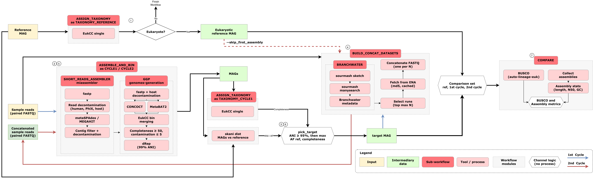

# ebi-metagenomics/mag-polishing-pipeline

[](https://github.com/EBI-Metagenomics/mag-polishing-pipeline/actions/workflows/nf_tests.yml)
[](https://github.com/EBI-Metagenomics/mag-polishing-pipeline/actions/workflows/linting.yml)
[](https://github.com/EBI-Metagenomics/mag-polishing-pipeline/actions/workflows/python_tests.yml)
[](https://www.nextflow.io/)
[](https://github.com/nf-core/tools/releases/tag/3.2.0)

## Introduction

# MGnify MAG polishing pipeline

Improves the quality of a metagenome-assembled genome (MAG) by recruiting public metagenomic samples that contain the same organism. The pipeline assembles the source sample with [miassembler v3.1.16](https://github.com/EBI-Metagenomics/miassembler) (first assembly is optional), bins it with the [genomes-generation pipeline v1.3.3](https://github.com/EBI-Metagenomics/genomes-generation) (GGP), searches [Branchwater](https://branchwater.jgi.doe.gov/) for samples that contain the MAG, and co-assembles the source sample with them to measure how much the MAG improves.



## Pipeline description

Each sample (paired-end reads plus a MAG, referred here as reference genome) goes through two rounds of analysis, referred to here as `Cycle 1` and `Cycle 2`. The current version works only for eukaryotes and short-read assemblies. The main steps, shown in the [schema](#mgnify-mag-polishing-pipeline), are:

1. Check that the reference genome is eukaryotic; if it is not, the run stops.
2. `[Cycle 1]` Assemble the sample reads with metaSPAdes or MEGAHIT (miassembler) and bin the assembly with GGP.
3. `[Cycle 1]` Select the MAG that matches the reference genome, by average nucleotide identity (ANI) with skani.
4. Search Branchwater with the `Cycle 1` MAG, or with the reference genome when `--skip_first_assembly` is set, and build one co-assembly dataset per value of `--n_concat_samples`: the sample reads concatenated with the reads of the top Branchwater hits.
5. `[Cycle 2]` Repeat step 2 on each concatenated dataset.
6. `[Cycle 2]` Repeat step 3 on the `Cycle 2` MAGs.
7. Run BUSCO and assembly metrics, and write one table with the reference genome and the matching MAGs from `Cycle 1` and `Cycle 2`.

With `--skip_first_assembly`, `Cycle 1` is dropped: Branchwater is searched with the reference genome, and the comparison is reference vs `Cycle 2` only. See [`--skip_first_assembly`](docs/usage.md#pipeline) and [`--n_concat_samples`](docs/usage.md#co-assembly-depths---n_concat_samples) in the usage documentation.

> [!NOTE] > `--n_concat_samples` accepts comma-separated values, e.g. `--n_concat_samples 1,2,3`. The aim is to
> benchmark how many additional samples are, in general, needed to improve a MAG. This logic is a temporary
> feature and is storage-hungry, considering that each value on `--n_concat_samples` will generate a new
> pair of fastq files and all the intermediate files generated during miassembler and GPP subworkflows.

### Features

**Reference check and taxonomy** (`subworkflows/local/assign_taxonomy`)

- Runs EukCC on every genome in the analysis (the reference and every MAG from both cycles), so taxonomy, completeness, contamination and BUSCO metrics are generated for each genome of the target organism.
- Fails fast when the reference genome does not descend from Eukaryota (NCBI taxid `2759`).

**Assembly** (miassembler, `SHORT_READS_ASSEMBLER`)

- Read QC with fastp, and removal of human and PhiX reads with bwa-mem2.
- Assembly with metaSPAdes (default for paired-end reads) or MEGAHIT (`--assembler megahit`).
- Contig QC: length filter, removal of contaminant contigs with minimap2, QUAST metrics and per-contig coverage.

For mode details, check [miassembler](https://github.com/EBI-Metagenomics/miassembler/tree/v3.1.16) repository.

**Binning** (GGP, eukaryotic branch only, `--skip_prok true`)

- Read QC and host decontamination, then binning with CONCOCT and MetaBAT2.
- Bin refinement and quality filtering with EukCC (completeness ≥ 50%, contamination ≤ 5%).
- Per-run dereplication with dRep. The pipeline takes these per-run bins, not GGP's study-level MAGs, so the genomes of each dataset are kept apart.

For mode details, check [GPP](https://github.com/EBI-Metagenomics/genomes-generation/tree/v1.3.3) repository.

**MAG selection** (`modules/local/skani_dist`)

- Aligns every MAG of each assembly to the reference genome with [skani](https://www.nature.com/articles/s41592-023-02018-3).
- Picks the MAG with ANI ≥ 95%, then the largest fraction of the reference covered, then the highest completeness.
- Warns, naming the closest MAG, when no MAG reaches 95% ANI.

**Branchwater search** (`subworkflows/local/branchwater`)

- Sketches the query genome with sourmash (k = 21, scaled = 1000) and searches the Branchwater index with `manysearch`.
- Resolves hits to ENA runs through the Branchwater metadata (DuckDB), keeping paired-end runs above the containment threshold (`--branchwater_threshold`).

**Co-assembly datasets** (`subworkflows/local/build_concat_datasets`)

- Downloads the selected runs from ENA with md5 verification, into a cache shared across samples and N values (`--ena_cache_dir`).
- Concatenates the sample reads with the top N hits, once per value of `--n_concat_samples`.

**Comparison** (`subworkflows/local/compare`)

- BUSCO and assembly statistics (length, N50, GC content, number of contigs) for the reference and each selected MAG.
- One `output.tsv` with every metric, the skani ANI and aligned fraction, and the runs concatenated into each MAG.

### Tools

Versions are the ones reported by a pipeline run.

**Reference check and taxonomy**

| Tool                                               | Version | Purpose                                                           |
| -------------------------------------------------- | ------- | ----------------------------------------------------------------- |
| [EukCC](https://github.com/EBI-Metagenomics/EukCC) | 2.2.0   | Taxonomy, completeness and contamination of every genome compared |

**Assembly (miassembler)**

| Tool                                                                 | Version      | Purpose                                                 |
| -------------------------------------------------------------------- | ------------ | ------------------------------------------------------- |
| [FastQC](https://www.bioinformatics.babraham.ac.uk/projects/fastqc/) | 0.12.1       | Read quality reports                                    |
| [fastp](https://github.com/OpenGene/fastp)                           | 0.23.4       | Read trimming and filtering                             |
| [bwa-mem2](https://github.com/bwa-mem2/bwa-mem2)                     | 2.2.1        | Human and PhiX read decontamination; contig coverage    |
| [metaSPAdes](https://github.com/ablab/spades)                        | 3.15.5       | Assembly (default)                                      |
| [MEGAHIT](https://github.com/voutcn/megahit)                         | 1.2.9        | Assembly (`--assembler megahit`)                        |
| [SeqKit](https://bioinf.shenwei.me/seqkit/)                          | 2.6.1, 2.9.0 | Contig length filter and removal of contaminant contigs |
| [minimap2](https://github.com/lh3/minimap2)                          | 2.28-r1209   | Alignment of contigs to the contaminant references      |
| [QUAST](https://github.com/ablab/quast)                              | 5.2.0        | Assembly metrics                                        |

**Binning (GGP)**

| Tool                                                                 | Version | Purpose                                           |
| -------------------------------------------------------------------- | ------- | ------------------------------------------------- |
| [FastQC](https://www.bioinformatics.babraham.ac.uk/projects/fastqc/) | 0.12.1  | Read quality reports                              |
| [fastp](https://github.com/OpenGene/fastp)                           | 0.23.4  | Read trimming and filtering                       |
| [bwa-mem2](https://github.com/bwa-mem2/bwa-mem2)                     | 2.2.1   | Host decontamination and read mapping for binning |
| [CONCOCT](https://github.com/BinPro/CONCOCT)                         | 1.1.0   | Binning                                           |
| [MetaBAT2](https://bitbucket.org/berkeleylab/metabat)                | 2.15    | Binning                                           |
| [EukCC](https://github.com/EBI-Metagenomics/EukCC)                   | 2.1.2   | Bin refinement, completeness and contamination    |
| [dRep](https://github.com/MrOlm/drep)                                | 3.6.2   | Per-run and study-level dereplication             |
| [BUSCO](https://busco.ezlab.org/)                                    | 5.4.7   | Bin completeness                                  |
| [CAT/BAT](https://github.com/MGXlab/CAT_pack)                        | 5.2.3   | Bin taxonomy                                      |
| [pigz](https://zlib.net/pigz/)                                       | 2.8     | Bin compression                                   |

**MAG selection**

| Tool                                            | Version | Purpose                                        |
| ----------------------------------------------- | ------- | ---------------------------------------------- |
| [skani](https://github.com/bluenote-1577/skani) | 0.3.2   | ANI and aligned fraction against the reference |

**Branchwater search and co-assembly datasets**

| Tool                                                                                       | Version | Purpose                                         |
| ------------------------------------------------------------------------------------------ | ------- | ----------------------------------------------- |
| [sourmash](https://github.com/sourmash-bio/sourmash)                                       | 4.8.14  | Sketching the query genome                      |
| [sourmash branchwater plugin](https://github.com/sourmash-bio/sourmash_plugin_branchwater) | 0.9.13  | `manysearch` against the Branchwater index      |
| [DuckDB](https://duckdb.org/)                                                              | 1.5.5   | Querying the Branchwater metadata               |
| [Python](https://www.python.org/)                                                          | 3.12    | Hit selection, ENA download, read concatenation |

**Comparison**

| Tool                              | Version | Purpose                              |
| --------------------------------- | ------- | ------------------------------------ |
| [BUSCO](https://busco.ezlab.org/) | 5.8.0   | Completeness of each genome compared |

### Reference databases

| Reference database                                                               | Version          | Used by                                  | Download                                                                                                 |
| -------------------------------------------------------------------------------- | ---------------- | ---------------------------------------- | -------------------------------------------------------------------------------------------------------- |
| [EukCC database](https://eukcc.readthedocs.io/)                                  | 1.2              | Reference check and taxonomy; GGP        | https://eukcc.readthedocs.io/en/latest/quickstart.html                                                   |
| Human genome GRCh38 (`human_GCF_000001405.40`)                                   | GCF_000001405.40 | miassembler and GGP read decontamination | [EBI FTP](https://ftp.ebi.ac.uk/pub/databases/metagenomics/pipelines/references/)                        |
| PhiX174 genome (`phiX174_GCF_000819615.1`)                                       | GCF_000819615.1  | miassembler read decontamination         | [EBI FTP](https://ftp.ebi.ac.uk/pub/databases/metagenomics/pipelines/references/)                        |
| [BUSCO lineages](https://busco.ezlab.org/)                                       | 2024-01-08       | GGP; comparison                          | https://busco-data.ezlab.org/v5/data/                                                                    |
| [CAT/BAT database](https://github.com/MGXlab/CAT_pack)                           | 2021-01-07       | GGP                                      | https://github.com/MGXlab/CAT_pack?tab=readme-ov-file#downloading-preconstructed-database-files          |
| [Branchwater index](https://branchwater.jgi.doe.gov/) (sourmash RocksDB, k = 21) | 2024-11-28       | Branchwater search                       | EBI internal; see the [Branchwater project](https://github.com/sourmash-bio/sourmash_plugin_branchwater) |
| Branchwater metadata (DuckDB)                                                    | —                | Branchwater search                       | EBI internal                                                                                             |

## Requirements

- Nextflow 24.04.3.
- Docker or Singularity, plus the reference databases listed above.
- Java 17+ and git.

## Configure the environment

```bash
git clone https://github.com/EBI-Metagenomics/mag-polishing-pipeline.git
cd mag-polishing-pipeline
git submodule update --init --recursive
```

## Execution

Prepare a samplesheet with your input data:

`samplesheet.csv`:

```csv
sample,fastq_1,fastq_2,genome
SAMPLE_001,/data/SAMPLE_001_1.fastq.gz,/data/SAMPLE_001_2.fastq.gz,/data/SAMPLE_001.fna.gz
```

Each row is one sample: paired-end reads plus the eukaryotic reference genome it is
compared against. Then:

```bash
NXF_VER=24.04.3 nextflow run EBI-Metagenomics/mag-polishing-pipeline \
   -profile <docker/singularity/codon> \
   --n_concat_samples 2 \
   --input samplesheet.csv \
   --outdir <OUTDIR>
```

Using MEGAHIT as the assembler:

```bash
NXF_VER=24.04.3 nextflow run EBI-Metagenomics/mag-polishing-pipeline \
   -profile <docker/singularity/codon> \
   --n_concat_samples 2 \
   --assembler megahit \
   --input samplesheet.csv \
   --outdir <OUTDIR>
```

Creating more than one concatenated dataset (e.g. for benchmarking):

```bash
NXF_VER=24.04.3 nextflow run EBI-Metagenomics/mag-polishing-pipeline \
   -profile <docker/singularity/codon> \
   --n_concat_samples 1,2,3 \
   --assembler megahit \
   --input samplesheet.csv \
   --outdir <OUTDIR>
```

> [!WARNING]
> Provide pipeline parameters via the CLI or Nextflow `-params-file` option. Custom config
> files including those provided by the `-c` Nextflow option can be used to provide any
> configuration _**except for parameters**_; see
> [docs](https://nf-co.re/docs/usage/getting_started/configuration#custom-configuration-files).

For more details and further functionality, please refer to the [usage documentation](docs/usage.md)
and the [parameter documentation](docs/usage.md#parameters).

## Outputs

For more details about the output files and reports, please refer to the
[output documentation](docs/output.md).

## Checks

```bash
# python unit tests: bin/*.py
pip install -r requirements-dev.txt
pytest

# nextflow unit tests: functions, local modules, local subworkflows
NXF_VER=24.04.3 nf-test test

export NXF_VER=24.04.3

# builds the whole DAG, both cycles, without running anything
nextflow run . -preview -profile test --outdir /tmp/mag-polishing

# the merged config, including both upstream modules.config files
nextflow config . -profile codon

# the nf-core template contract. The version MUST match `nf_core_version` in .nf-core.yml
NXF_SYNTAX_PARSER=v1 uvx --from 'nf-core==3.2.0' nf-core pipelines lint
```

A full run of `main.nf` is not testable here: several miassembler and GGP processes
(`SPADES` among them) have no `stub` block, so they would actually run. That is why the
pipeline-level check is `-preview` rather than an nf-test.

## Credits

EBI-Metagenomics/mag-polishing-pipeline was originally written by Filipe Dezordi.

This pipeline is an orchestrator. It composes, in a single Nextflow runtime:

| Component                                                                    | Where                                                   | Pinned at |
| ---------------------------------------------------------------------------- | ------------------------------------------------------- | --------- |
| [miassembler](https://github.com/EBI-Metagenomics/miassembler)               | git submodule, `pipelines/miassembler`                  | `v3.1.16` |
| [genomes-generation](https://github.com/EBI-Metagenomics/genomes-generation) | git submodule, `pipelines/genomes-generation`           | `v1.3.3`  |
| [branchwater-nf](https://github.com/EBI-Metagenomics/branchwater-nf)         | reimplemented locally, `subworkflows/local/branchwater` | —         |
| `compare`                                                                    | local, `subworkflows/local/compare`                     | —         |

## Contributions and Support

If you would like to contribute to this pipeline, please see the
[contributing guidelines](.github/CONTRIBUTING.md).

## Citations

An extensive list of references for the tools used by the pipeline can be found in the
[`CITATIONS.md`](CITATIONS.md) file.

This pipeline uses code and infrastructure developed and maintained by the
[nf-core](https://nf-co.re) community, reused here under the
[MIT license](https://github.com/nf-core/tools/blob/main/LICENSE).

> **The nf-core framework for community-curated bioinformatics pipelines.**
>
> Philip Ewels, Alexander Peltzer, Sven Fillinger, Harshil Patel, Johannes Alneberg,
> Andreas Wilm, Maxime Ulysse Garcia, Paolo Di Tommaso & Sven Nahnsen.
>
> _Nat Biotechnol._ 2020 Feb 13. doi: [10.1038/s41587-020-0439-x](https://dx.doi.org/10.1038/s41587-020-0439-x).
